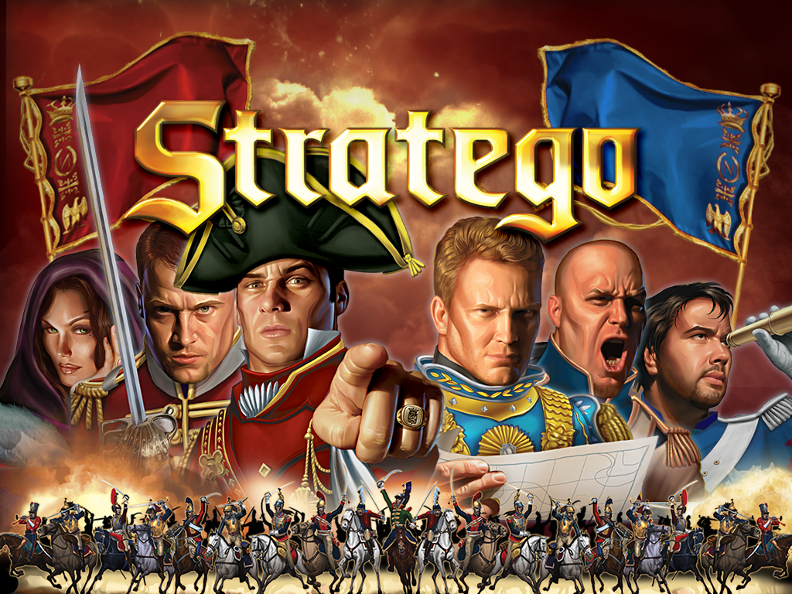

# Stratego

This project aims to recreate the classic board game of Stratego.  Stratego is a game in which you need to capture the flag of your opponent while defending your own flag. To capture the flag you use your army of 40 pieces. Pieces have a rank and represent individual officers and soldiers in an army. In addition to those ranked pieces you can use bombs to protect your flag.

# The Game

## Rules
The general game rules are as follows.
- Flags and bombs can't be moved once the game begins.
- Moveable pieces may only vertically and horizontally.
- If attacker is equal to defender, both pieces become demoralized and desert the battlefield.
- First player to capture the opponents flag wins.
- Soldiers may not enter the water.
- Player loses if they run out of moveable pieces.
- A piece may not move back and forth between the same two squares in three consecutive moves.

For the complete list of rules in the official game please visit
https://en.wikipedia.org/wiki/Stratego

## Pieces
| Piece Name |Icon | Rank | Amount | Description |
| :------------- | :------------- | :------------- | :------------- | :------------- |
| <center>**Flag**</center>| 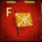| None | 1 | Must be defended at all costs.  The game ends when yours is captured |
| <center>**Bomb**</center>| 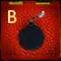 | [0] | 6 | Able to defeat all pieces except Miners but unable to move. |
| <center>**Spy**</center>| 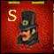 | [1] | 1 | Defeated by all pieces but able to defeat the Marshal(10) if attacking first. |
| <center>**Scout**</center>| 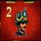 | [2] | 8 | Able to move as many empty squares as it chooses to. |
| <center>**Miner**</center>| 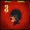 | [3] | 5 | Able to diffuse bombs without taking damage. |
| <center>**Sergeant**</center>| 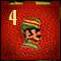 | [4] | 5 | None. |
| <center>**Lieutenant**</center>| 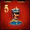 | [5] | 4 | None. |
| <center>**Captain**</center>| 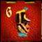 | [6] | 4 | None. |
| <center>**Major**</center>| 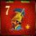 | [7] | 3 | None. |
| <center>**Colonel**</center>| 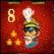 | [8] | 2 | None. |
| <center>**General**</center>| 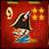 | [9] | 1 | None. |
| <center>**Marshal**</center>| 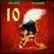 | [10] | 1 | None. |

## Win Condition

- Capture the Opponents flag

# Setup

## Where to play

- The deployed game can be found [here](https://stratego-57462.firebaseapp.com/)

## Game Setup
#### New Game

1. Input player name on the top box.
2. Press Create Game button.
3. Copy the code that pops up and send it to your friend.

#### Join Game
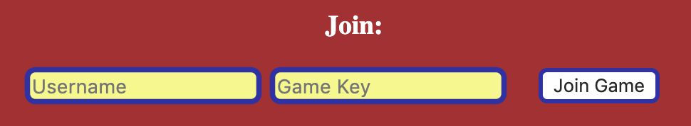
1. Input player name in the bottom left box.
2. Paste the code that was provided by the opponent.
3. Press the Join Game button.


# The Code

## Client-side/Server-side Piece Comparing
### This sample allows for the database and our client side pieces to be compared and match.
```
<<Insert>>
```

## Game Database Retrieval
### This sample allows us to determine how many pieces remain in the database for the player to utilize.
```
<<Insert>>
```

## Placement
### This sample allows us to place the elements we need on the board during the initial stages.
```
<<Insert>>
```

## Combat
### This sample allows us to determine winners and loser during an engagement.
```
<<Insert>>
```

## Victory
### This sample allows us to determine the final winner and ends the game.
```
<<Insert>>
```

# To DO
```
Placement
    - captured (GY) pcs not selectable after game starts
Initialize:
    - both players click ready button
        + ready player sees "waiting on other player to ready"
    - host player clicks start game
    - local data from both players sent to DB
Movement:
    - one square for all but Scout
        - scout moves as many as it wants in a single straight line
    - can't move to space occupied by your own
    - if landing on square occupied by enemy initiate combat()
    - no diagonal
    - no lake
    - highlight available movements ??
Combat:
    - show enemy tile
    - results text ??
```

## Known Bugs
* If players place a piece at the same time, the server can erase one of the placements.

## Support and contact details

If you have any issues please contact:

* Brendan Hellar - bwhellar@gmail.com
* Zach Weintraub - zachweintraub@gmail.com
* Dylan Crocker - dylan.t.crocker@gmail.com
* Crystal Fecteau - Crystal_Fecteau@ymail.com
* Kyle Harrington - harrington.kyle@gmail.com

## Technologies Used

* HTML
* CSS
* JavaScript
* Angular
* Firebase (Database)

## Angular

This project was generated with [Angular CLI](https://github.com/angular/angular-cli) version 1.6.5.

## Development server

Run `ng serve` for a dev server. Navigate to `http://localhost:4200/`. The app will automatically reload if you change any of the source files.

### License

*This software is licensed under the MIT license*

Copyright (c) 2019**_{Brendan Hellar, Zach Weintraub, Dylan Crocker, Crystal Fecteau, Kyle Harrington}_
